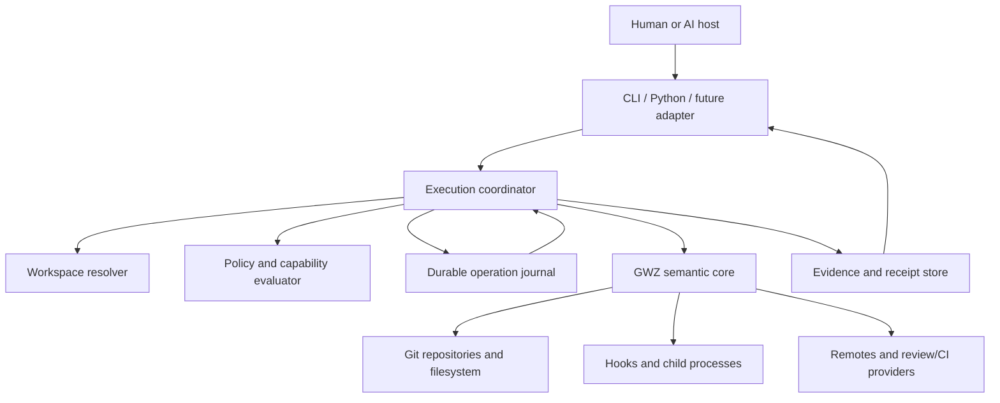
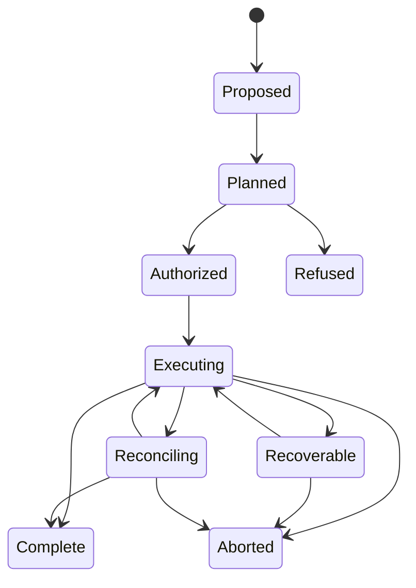

# GWZ AI Execution Layer — Requirements and Design Direction

Date: 2026-09-01

Status: Revised after adversarial review; AI-0 and the bounded AI-1S proof are
specified, but no public interface is frozen

Review: [GwzAiReqDd-AdversarialReview.md](GwzAiReqDd-AdversarialReview.md)

## 1. Purpose

GWZ is intended to be a first-class, model-agnostic execution layer for humans
and AI systems that operate across multiple independent Git repositories.

An AI host should decide *what outcome it wants*. GWZ should own the difficult
parts of carrying that intent out safely across a workspace: resolving scope,
checking authority, producing a deterministic plan, applying effects, surviving
retries and interruption, and returning exact evidence of what happened.

This document defines the requirements and design direction for that execution
layer. It does not define an LLM runtime, an agent framework, or an AI-specific
replacement for the existing CLI. The same semantics must remain usable by a
human, a script, Python, or a future agent adapter.

This document also does **not** expand M5. M5c remains the narrowly chartered
completion of the ordinary/custom merge v1 lifecycle. Its merge plan, drift
handling, event stream, and durable state are useful proving grounds for this
design, but execution-layer work must follow M5 rather than ride inside it.

## 2. Product thesis

The execution layer exists to provide one strong boundary:

> An untrusted or fallible controller may request a workspace operation, but
> only GWZ may authorize, plan, execute, recover, and attest its effects.

This boundary matters more for AI than for ordinary shell automation because an
AI controller is probabilistic, retry-prone, vulnerable to hostile repository
content, and often asked to operate without a human inspecting every command.
GWZ must convert that uncertain intent into deterministic, reviewable actions.

GWZ should be better than a collection of per-repository loops because it has a
workspace model and can preserve cross-repository identity. It should remain
better than a monorepo conversion because every member remains an ordinary,
independent Git repository with its own remotes, history, access policy, and CI.

### 2.1 What is specifically different for AI

Most mechanisms in this document are good automation engineering and should
benefit human and CI callers too. The AI-specific threat drivers are narrower:

- an AI host may deliver the same request repeatedly because it cannot know
  whether a timed-out call took effect;
- natural-language intent is probabilistic and must be lowered into a typed,
  canonical request before it can authorize an effect;
- repository content, issue text, remote comments, and tool output can contain
  prompt injection that an AI host mistakes for authoritative instructions;
- an unattended controller needs narrower, explicit capabilities than a human
  shell session normally inherits;
- the controller may lose conversational context, so recovery cannot depend on
  what the model remembers; and
- explanations must be structured enough for a controller to act on without
  giving prose the power to widen authority.

The execution layer is therefore reliable automation with an explicit trust
boundary for a probabilistic controller. It is not a separate “AI mode.”

## 3. Scope and non-goals

### 3.1 In scope

- Workspace-aware intent, planning, authorization, execution, and evidence.
- Durable operation identity, retries, cancellation, recovery, and
  reconciliation.
- Full-clone task isolation in a later milestone; GWZ intentionally does not
  support Git worktrees.
- Explicit authority over repository, filesystem, process, hook, network, and
  credential effects.
- Trusted and untrusted instruction provenance.
- Cross-repository change identity, review, CI, publication, and partial-failure
  reconciliation as a separately designed future milestone.
- Stable, transport-neutral machine interfaces for AI hosts and automation.
- Human-visible explanations that are derived from the same typed state.

### 3.2 Non-goals

- Choosing or hosting an LLM.
- Prompt construction, model routing, token accounting, or conversation memory.
- Replacing Git hosting, CI providers, secret managers, or operating-system
  sandboxing.
- Pretending that remote systems can participate in an atomic transaction.
- Supporting Git worktrees as a task-isolation mechanism.
- Letting repository instructions, model output, or adapter code grant itself
  additional authority.
- Duplicating core semantics independently in Rust, Python, an MCP server, or a
  shell wrapper.

### 3.3 Charter boundary

Section 6 describes the target execution layer. It is not permission to
implement all target requirements together. The only implementation-shaped
charter in this revision is **AI-1S**, the local snapshot-create proof in
section 12.2.

AI-1S excludes task-clone creation, repository hooks or executables, network and
credential use, remote review or CI, general policy languages, daemon/service
operation, MCP or JSON-RPC, and any public `gwz ai` command. Later sections are
roadmap requirements whose implementation requires their own design and review.

## 4. Terms

| Term | Meaning |
|---|---|
| AI host | The controller that selects a goal and invokes GWZ. It may be an agent, IDE, CI job, or script. |
| Adapter | A transport binding such as the CLI, Python API, JSON-RPC, or a future MCP server. |
| Execution layer | The GWZ boundary that turns intent into authorized, durable, evidenced effects. |
| Intent | A typed request describing a desired operation, targets, constraints, and idempotency identity. |
| Plan | An immutable, hash-addressed expansion of intent against an exact workspace state and policy. |
| Capability | An explicit grant for a bounded class of effects. It is not inferred from prose. |
| Operation | One durable attempt to execute a plan, identified independently of the process that runs it. |
| Receipt | Machine-readable evidence of the operation's inputs, decisions, effects, outcomes, and unresolved work. |
| Task environment | A complete clone set used to isolate one task. It is never a Git worktree. |
| Workspace change | A durable identity linking the related commits, reviews, CI checks, and publication state across repositories. |
| Degradation | A typed loss of completeness that is retained in the result rather than silently treated as success. |

## 5. Governing invariants

The initial execution layer must preserve these invariants:

1. **No effect outside the authorized plan.** An adapter, model, repository
   instruction, hook, or retry cannot widen the plan's authority.
2. **No effect without a durable intent/effect fence.** GWZ records sufficient
   state before an externally visible mutation to decide safely whether to
   continue, reconcile, or refuse after interruption.
3. **Every accepted operation is inspectable.** Every terminal path returns a
   receipt or a durable operation identifier through which the result can be
   obtained.
4. **Same identity and same intent converge.** Retrying an operation does not
   duplicate an effect that GWZ can prove was already performed.
5. **Same identity and different intent refuse.** An idempotency-key collision
   can never be interpreted as authorization for a different action.
6. **Partial success is not success.** Cross-repository or remote partial
   outcomes remain typed, visible, and reconcilable.
7. **One semantic core.** All adapters lower to the same typed operations and
   consume the same typed responses, events, and errors.
8. **Human parity.** Any operation exposed to an AI host is explainable,
   inspectable, and recoverable by a human without using an LLM.

## 6. Requirements

The priorities in this section are normative: **MUST** is a release condition
for the relevant execution-layer milestone, **SHOULD** requires an explicit
disposition if omitted, and **MAY** is optional. “Relevant milestone” is
important: only the requirement subset named by a charter is active for that
charter. Target-state rows cannot be pulled into AI-1S by implication.

### 6.1 Execution lifecycle

| ID | Priority | Requirement |
|---|---|---|
| AI-EXE-01 | MUST | Every mutating execution-layer request carries an operation identity and a canonical intent digest. |
| AI-EXE-02 | MUST | Planning binds the operation to the workspace identity, root and selected members, exact relevant refs, manifest and lock digests, policy digest, tool/protocol version, and normalized intent. |
| AI-EXE-03 | MUST | A plan lists every anticipated repository, filesystem, process, hook, network, credential, and remote-hosting effect. Unknown effect classes refuse authorization. |
| AI-EXE-04 | MUST | Plans are immutable and hash-addressed. Applying a plan whose bound inputs have drifted returns a typed refusal or a new plan; it never silently replans. |
| AI-EXE-05 | MUST | Execution records a durable pre-effect fence and a durable post-effect observation for every non-idempotent or externally visible step. |
| AI-EXE-06 | MUST | The same operation identity plus the same canonical intent converges under retry. The same identity plus a different intent is a typed collision. |
| AI-EXE-07 | MUST | Operation state is inspectable as proposed, planned, authorized, executing, complete, recoverable, refused, or aborted. Remote publication may additionally be reconciling. |
| AI-EXE-08 | MUST | Cancellation defines a durable boundary: completed effects remain evidenced; unstarted effects do not begin; an in-flight uninterruptible effect is reported explicitly. |
| AI-EXE-09 | MUST | Concurrent operations use leases or equivalent ownership with expiry, renewal, stale-owner recovery, and a typed refusal for incompatible live work. |
| AI-EXE-10 | MUST | Crashes, process loss, repeated delivery, and host restart are acceptance scenarios, not exceptional unsupported states. |
| AI-EXE-11 | MUST | Aggregate `Ok` is impossible when any selected repository is failed, unreadable, unresolved, or only partially published. |
| AI-EXE-12 | SHOULD | Read-only operations use the same plan and receipt vocabulary when doing so materially improves auditability without forcing unnecessary durable state. |

### 6.2 Task isolation

| ID | Priority | Requirement |
|---|---|---|
| AI-ISO-01 | MUST | An isolated task environment is represented by complete repository clones, not Git worktrees. |
| AI-ISO-02 | MUST | Each task environment has a stable identity bound to its workspace manifest, member origins, clone paths, creation provenance, and owning operation or controller. |
| AI-ISO-03 | MUST | Creating, adopting, inspecting, and removing a task environment are typed GWZ operations with receipts. Cleanup is recoverable and refuses ambiguous ownership. |
| AI-ISO-04 | MUST | A task clone cannot be mistaken for the authoritative workspace or for another task clone merely because refs or filesystem paths match. |
| AI-ISO-05 | SHOULD | Clone creation supports local object reuse where Git can do so without weakening repository independence or task ownership. |
| AI-ISO-06 | SHOULD | Disk, repository-count, and age policies can enumerate and safely retire abandoned task environments. |

### 6.3 Authority, policy, and security

| ID | Priority | Requirement |
|---|---|---|
| AI-AUT-01 | MUST | Authority is represented as typed capabilities, not inferred from a prompt, repository file, model identity, or prior success. |
| AI-AUT-02 | MUST | Capabilities bound operation types, targets, paths, hooks, commands, network destinations, remotes, credentials, publication rights, and expiry where applicable. |
| AI-AUT-03 | MUST | Planning may describe effects outside current authority, but authorization and execution fail closed until every effect is covered. |
| AI-AUT-04 | MUST | Repository content and instructions can reduce requested behavior or supply context but can never enlarge capabilities. |
| AI-AUT-05 | MUST | Hooks and arbitrary repository executables are separately declared effects. Policy may deny them, sandbox them, or require interactive approval. |
| AI-AUT-06 | MUST | Secret values are never written to plans, events, receipts, logs, prompts, or command lines. Evidence records a redacted credential reference and usage class. |
| AI-AUT-07 | MUST | Network access is destination- and purpose-bounded. A generic `network=true` grant is insufficient for a mutating operation. |
| AI-AUT-08 | MUST | Policy evaluation is deterministic, versioned, and included in the plan digest. A policy change invalidates authorization. |
| AI-AUT-09 | MUST | Approval records identify the approver, approved plan digest, capability set, time, and expiry. Approval of intent text alone is insufficient. |
| AI-AUT-10 | SHOULD | Organizations can supply policy without modifying repositories, while repository-local policy may further restrict it. |

### 6.4 Instructions and context

| ID | Priority | Requirement |
|---|---|---|
| AI-CTX-01 | MUST | Instructions have explicit provenance and precedence: GWZ/system policy, workspace-managed instructions, repository-managed instructions, user request, and untrusted discovered content are distinguishable. |
| AI-CTX-02 | MUST | The execution layer treats issue text, source files, commit messages, build output, remote comments, and fetched content as untrusted data even when an AI host interprets them as instructions. |
| AI-CTX-03 | MUST | A receipt records the instruction-source digests that materially influenced planning without copying secrets or arbitrarily large content. |
| AI-CTX-04 | MUST | Conflicting authoritative instructions produce a typed conflict that names the sources and precedence rule. Silent last-writer-wins behavior is forbidden. |
| AI-CTX-05 | SHOULD | GWZ can produce a bounded context manifest describing relevant repositories, instructions, refs, and policy for an AI host without embedding model-specific prompt text. |
| AI-CTX-06 | SHOULD | Context selection is explainable: omitted and included sources have machine-readable reasons. |

### 6.5 Evidence, explanation, and audit

| ID | Priority | Requirement |
|---|---|---|
| AI-EVD-01 | MUST | Every terminal receipt names the operation, plan digest, exact before and observed-after repository states, performed effects, skipped effects, degradations, errors, and reconciliation work. |
| AI-EVD-02 | MUST | Evidence distinguishes requested, planned, authorized, attempted, observed, and inferred facts. |
| AI-EVD-03 | MUST | Receipts are append-verifiable or otherwise tamper-evident within GWZ's cooperating-user threat envelope. |
| AI-EVD-04 | MUST | Redaction is explicit. A consumer can tell that a value was removed, why, and which stable non-secret digest binds the omitted evidence. |
| AI-EVD-05 | MUST | `explain`-class output derives from typed plan, policy, state, and error data. It never invents a remedy that the core did not classify. |
| AI-EVD-06 | MUST | Teaching refusals name the conflicting object or capability, explain the safe next action, and mark whether that action is destructive or authority-widening. |
| AI-EVD-07 | SHOULD | Evidence can be exported as a portable bundle for review, incident analysis, or CI attestation. |
| AI-EVD-08 | SHOULD | Retention policy is configurable by evidence class and protects operation identity even after detailed payloads expire. |

### 6.6 Cross-repository review and delivery

| ID | Priority | Requirement |
|---|---|---|
| AI-CHG-01 | MUST | A workspace change has one durable identity that links its member commits, root commit where applicable, reviews, checks, remote branches, and publication state. |
| AI-CHG-02 | MUST | GWZ models remote publication as a sequence of observable effects, not an atomic workspace transaction. |
| AI-CHG-03 | MUST | Partial branch pushes, partially opened reviews, divergent review status, and failed CI are explicit reconciling states with safe next actions. |
| AI-CHG-04 | MUST | Reconciliation proves remote identity before updating, closing, superseding, or retrying a review or branch. Similar names are not sufficient proof. |
| AI-CHG-05 | MUST | Required checks and review policy are evaluated per repository and as a workspace aggregate. The aggregate cannot hide a failing or absent member result. |
| AI-CHG-06 | SHOULD | Providers are adapters over one provider-neutral workspace-change state machine. Provider-specific identifiers remain evidence, not core semantics. |
| AI-CHG-07 | SHOULD | A human can inspect and continue a workspace change without the original AI host or conversation. |

### 6.7 Interfaces and compatibility

| ID | Priority | Requirement |
|---|---|---|
| AI-API-01 | MUST | CLI, Python, and future adapters lower through the same generated request/response/event schemas and semantic core. |
| AI-API-02 | MUST | Adapters contain transport, encoding, and lifecycle code only. They do not independently implement selection, policy, planning, retry, or aggregation. |
| AI-API-03 | MUST | Schemas are versioned and additive by default. Semantic changes require an explicit version transition and compatibility disposition. |
| AI-API-04 | MUST | Capability negotiation reports operation, schema, and optional-feature support before an AI host submits a plan that depends on it. |
| AI-API-05 | MUST | Unknown values that affect authority, effects, identity, or recovery fail closed. Unknown descriptive fields may be preserved or ignored according to their schema contract. |
| AI-API-06 | MUST | Streaming APIs define ordering, backpressure, cancellation, terminal status, and release ownership. End-of-stream is not a substitute for a terminal receipt. |
| AI-API-07 | SHOULD | A future MCP or JSON-RPC adapter remains an optional process boundary. The core must not require a particular AI protocol. |
| AI-API-08 | SHOULD | Human and machine clients can request the same explanation and evidence objects even when their rendering differs. |

### 6.8 Operational bounds

| ID | Priority | Requirement |
|---|---|---|
| AI-OPS-01 | MUST | Repository concurrency, child processes, network operations, and buffered records have explicit ceilings observable in tests. |
| AI-OPS-02 | MUST | Planning and execution stream where possible; they do not collect unbounded repository histories or process output merely for convenience. |
| AI-OPS-03 | MUST | Resource exhaustion yields a typed recoverable or refused state without discarding an already accepted operation's identity. |
| AI-OPS-04 | MUST | Cleanup never guesses ownership. Unknown or mixed task state is reported for reconciliation. |
| AI-OPS-05 | SHOULD | The execution layer publishes timing and count metrics without exposing repository contents or secrets. |
| AI-OPS-06 | SHOULD | Expensive final cross-platform gates run once per landing candidate; narrow iterations use focused, mutation-tight tests. |

## 7. Threat model

The design assumes the operating-system account and GWZ installation are not
already fully compromised. Within that boundary, it must expect:

- an AI host that retries, crashes, supplies malformed input, or misunderstands
  a result;
- multiple controllers racing on the same workspace or task clones;
- hostile or misleading repository instructions, source, commit messages,
  generated output, issue text, and remote comments;
- hooks, build tools, and repository executables that can mutate unexpected
  files or attempt credential and network access;
- stale refs, rewritten history, detached or unborn repositories, inaccessible
  members, and locally modified manifests or lock files;
- process termination between any two durable or external effects;
- network partitions and remote providers that accept only a prefix of a
  requested change;
- loss, redaction, or corruption of local operation evidence.

A full repository clone is an isolation boundary for Git state, not a security
sandbox. Strong process, filesystem, credential, and network isolation requires
an operating-system or container boundary. GWZ must expose and enforce the
policy decision; it must not imply that cloning alone makes untrusted code safe.

### 7.1 Enforcement boundary

| Control | GWZ can enforce | Host or sandbox must enforce |
|---|---|---|
| Typed operation and selected repositories | Validate the canonical request and refuse effects outside the plan | Prevent an adapter from bypassing GWZ and invoking another tool directly |
| GWZ-owned files and Git refs | Use exact paths, no-follow checks, exclusive creation, compare-and-swap, and post-effect observation | Protect the filesystem from unrelated processes using the same account |
| Hooks and child processes | Refuse to start undeclared programs; select a named sandbox profile before launch | Constrain syscalls, filesystem visibility, environment, network, and descendants after launch |
| Credentials | Request an opaque credential reference for one declared use and never serialize its value | Store, inject, rotate, revoke, and prevent exfiltration by an allowed process |
| Network | Refuse undeclared destinations and pass an allowlist to the host | Enforce destination and protocol restrictions below the process |
| Repository instructions | Mark provenance and prevent them from granting capabilities | Prevent a model or controller from ignoring the typed authority result |

AI-1S executes no repository hook, executable, child process, network access, or
credential use. It reads Git state through the existing in-process backend and
creates one GWZ snapshot artifact. A later charter that executes repository code
MUST name an enforceable host sandbox profile; declaring the effect alone is not
sufficient.

## 8. Architecture



The diagram is the target architecture. AI-1S is not a daemon: the coordinator
is an in-process Rust component created for one invocation. Durability and the
lease live in the journal, so a later process can inspect or resume the
operation. Converting it into a long-lived authenticated service requires a new
charter because it changes ownership, cancellation, and threat boundaries.

### 8.1 Execution coordinator

The coordinator owns the operation state machine. It canonicalizes intent,
creates and binds a plan, requests policy authorization, fences effects,
delegates typed operations to the existing core, records observations, and
produces the terminal receipt. It is the only component allowed to interpret a
retry as continuation of an existing operation.

### 8.2 Workspace resolver

The resolver supplies exact workspace identity, enrolled repositories,
selection, refs, manifest and lock digests, task-clone identity, and instruction
sources. It does not mutate repositories during planning.

### 8.3 Policy and capability evaluator

The evaluator compares the complete planned effect set with explicit grants and
restrictions. Its input and result are deterministic and versioned. The first
implementation uses only the closed capabilities
`workspace.read_snapshot_state` and `snapshot.create:<snapshot-id>`. Approval is
for one exact plan digest, expires before its effect fence, and is not reusable
or delegable. AI-1S has no organization policy language; any request needing a
different capability refuses.

### 8.4 Durable operation journal

The journal is semantic state, not an implementation log. It records intent,
plan, approval, effect fences, observations, leases, cancellation, and terminal
receipt identity.

For AI-1S its physical home is the root repository Git directory, resolved by
the existing backend and never by string-appending to the workspace path:

```text
<root-git-dir>/gwz/execution/v0/
  keys/<sha256(length-prefixed client namespace and idempotency key)>
  operations/<operation-id>/state.cbor
  operations/<operation-id>/receipt.cbor
```

This state is local, uncommitted, and outside `gwz.conf`. Components use
no-follow path validation, exclusive create, same-directory temporary files,
atomic rename, file and parent-directory sync, and generation-plus-body-digest
compare-and-swap. A key record is published before the operation id can be
returned. Symlinks, non-files, unknown schemas, conflicting copies, or failed
durability checks produce a typed refusal or recoverable state; they are never
repaired by guessing. The initial implementation supports ordinary non-bare
root repositories only and refuses any layout for which the Git directory
cannot be proven. Broader repository layouts require a later charter.

### 8.5 Evidence store

The evidence store retains receipts and bounded supporting artifacts. It
applies redaction and retention policy without making the terminal operation
identity disappear.

Evidence is split into classes rather than applying one retention rule:

| Class | Contents | AI-1S retention |
|---|---|---|
| Recovery-critical | Canonical intent, plans, approval, fences, generations, effect digest, observations | Until terminal plus 30 days; never removed while recoverable |
| Identity tombstone | Workspace id, hashed client/key lookup, operation id, intent digest, terminal class | Retained after payload GC so a key cannot silently authorize different intent |
| Audit | Before/after identities, capability decision, receipt, binary/schema versions | 90 days by default; explicit export or policy may extend it |
| Diagnostic | Bounded error context with no repository body or secret values | 7 days by default |
| Secret reference | Opaque provider id and declared usage class only | Same as the referencing receipt; raw secret and raw-secret hash are forbidden |

Explicit `forget` may delete recovery, audit, and diagnostic payload only after
terminal state and authorization. It leaves the small identity tombstone. GWZ
never hashes a low-entropy secret as evidence; the secret provider supplies an
opaque identifier that does not reveal the value.

### 8.6 Existing GWZ semantic core

The core remains owner of workspace semantics: enrollment, selection, Git
operations, snapshots, merge lifecycle, commit identity, unified history,
errors, degradations, and checked artifacts. The execution layer coordinates
these operations; it does not reimplement them.

## 9. Illustrative data model

The following shapes are conceptual and do not freeze a wire format.

```text
ExecutionIntent {
  client_namespace
  idempotency_key
  operation_kind
  workspace_hint
  requested_targets
  parameters
  requested_capabilities
}

ExecutionPlan {
  plan_id = hash(canonical_plan)
  intent_digest
  workspace_identity
  selected_repositories[]
  bound_refs[]
  manifest_digest
  lock_digest
  policy_digest
  tool_and_protocol_versions
  effects[]
  required_capabilities[]
}

ExecutionReceipt {
  operation_id
  plan_id
  terminal_state
  before[]
  effects[]
  observed_after[]
  degradations[]
  unresolved[]
  evidence_refs[]
  redactions[]
}

WorkspaceChange {
  change_id
  operation_ids[]
  repository_commits[]
  remote_branches[]
  reviews[]
  checks[]
  aggregate_state
  reconciliation_actions[]
}
```

`WorkspaceChange` is future AI-3 vocabulary, not an AI-1S stored object.

### 9.1 AI-1S identity contract

The client supplies:

- a stable client namespace, 1–128 UTF-8 bytes;
- an opaque idempotency key, 1–128 UTF-8 bytes; and
- a typed snapshot-create request.

NUL is rejected. Bytes are preserved exactly; GWZ does not perform Unicode
normalization. Client namespaces and idempotency keys are identifiers, not
secrets, and callers MUST NOT place credentials or sensitive content in them.
The canonical intent is deterministic RFC 8949 canonical CBOR
with schema `gwz.execution-intent/v0`, fixed numeric field and enum tags,
expanded semantic defaults, canonical request selectors, exact snapshot-id
bytes, source mode, workspace id, and the two AI-1S capabilities. Resolved
member ids and commits belong to the plan, not the intent.
The intent digest is SHA-256 over the schema bytes, a NUL separator, and the
canonical CBOR bytes. This canonical form is an internal semantic encoding and
does not select a future adapter transport.

On first acceptance GWZ creates a UUIDv7 operation id and atomically binds:

```text
(workspace-id, client-namespace bytes, idempotency-key bytes)
    -> (operation-id, intent-digest)
```

The on-disk key name hashes an unambiguous length-prefixed encoding of the tuple;
the record body retains the workspace id, client namespace, key, operation id,
and digest so a hash collision is detectable. A repeated request with the same
tuple and digest returns the existing operation and its current state. The same
tuple with a different digest returns `IdempotencyKeyConflict` and performs no
read beyond the identity record. If the first response is lost, resubmitting the
same tuple and intent is the recovery mechanism. The operation id is never
accepted from the caller and is never derived only from a path or branch name.

An operation may contain multiple immutable plan revisions only before its
effect fence. `replan(operation-id)` appends a new plan, invalidates the prior
approval, and requires approval of the new digest. Once an effect fence exists,
that operation can only resume, reconcile, complete, or abort; replanning needs
a new idempotency key and therefore a new operation.

## 10. Lifecycle



`Complete` means the authorized plan reached its defined terminal outcome; it
does not mean every repository necessarily changed. A no-op may be complete.
`Recoverable` means local evidence is sufficient to continue safely.
`Reconciling` means external effects are known to be partial or divergent.
`Refused` means execution never acquired authority to begin. `Aborted` retains
all completed-effect evidence and names anything that could not be undone.

### 10.1 AI-1S snapshot-create state machine

AI-1S lowers only `gwz snapshot <snapshot-id>` with an explicit source mode and
selection. Planning reads the manifest, lock, resolved selection, and exact
member commits, assigns `created_at`, and constructs the exact snapshot artifact
bytes including the workspace, operation identity, members, and creation
metadata. The plan binds the SHA-256 digest of those bytes. Execution never
re-derives the artifact from later repository state.

| State | Durable fact | Permitted next action |
|---|---|---|
| Accepted | Key mapping, operation id, and canonical intent digest exist | Plan or inspect |
| Planned | Immutable plan revision and all bound inputs exist | Approve, explicitly replan, refuse, or cancel |
| Authorized | Approval binds exact plan digest and the two capabilities | Revalidate bound inputs, then prepare; or cancel |
| EffectPrepared | Exclusive effect fence binds destination and exact artifact digest | Create exact bytes, reconcile existing destination, or honor a cancellation observed before creation starts |
| EffectObserved | Destination was read back and exactly matches planned bytes and digest | Publish receipt |
| Complete | Receipt and terminal generation are durable | Inspect or apply retention policy |
| Recoverable | Exact evidence is insufficient for automatic completion but identifies the ambiguity | Human inspect, reconcile, or abort; never replan in place |
| Aborted | Cancellation or authorized abort is durable and no unobserved effect remains | Inspect only |

Snapshot publication is the one workspace effect. It uses exclusive atomic
creation; it never overwrites a snapshot. Journal writes are durability
mechanics, not hidden workspace effects, and remain fully evidenced.

If cancellation is durable before `EffectPrepared`, the operation becomes
`Aborted`. If cancellation is observed after preparation but before the atomic
create begins, GWZ records that the prepared effect was not attempted and then
aborts. Atomic creation is an uninterruptible effect: cancellation arriving
after it begins causes read-back reconciliation. An exact artifact completes
with `cancellation_requested_after_effect=true`; absence permits abort; differing
or unreadable content becomes `Recoverable`.

### 10.2 AI-1S drift and restart rules

| Change or restart condition | Before approval/effect fence | After effect fence |
|---|---|---|
| Manifest, lock, resolved selection, member ref, or source commit changed | Existing plan remains immutable; explicit replan is allowed and needs new approval | Do not consult live state to rewrite the effect; publish or reconcile the exact planned artifact |
| Policy or capability grant changed | Prior approval is invalid; replan or reauthorize explicitly | Continue only the already fenced snapshot effect; any additional effect refuses |
| Tool or schema version changed | Resume only if the current binary explicitly supports journal and plan v0; otherwise `SchemaUnsupported` | Same rule; incompatible binaries may inspect raw identity but cannot mutate |
| Snapshot destination absent after restart | Revalidate before fencing; otherwise proceed normally | Create the exact planned bytes unless cancellation was already durable |
| Snapshot destination exactly matches plan | Treat as a collision unless this operation already has a prepared fence for that digest | Observe and complete idempotently |
| Snapshot destination differs, is unreadable, or has ambiguous ownership | Refuse without fencing | Enter `Recoverable`; never overwrite, delete, or mint a new snapshot id |
| Lost response | Resubmit client namespace, key, and same intent to recover operation id | Same; return current state or terminal receipt |

The general rule “a stale plan is not silently applied” is satisfied at the
effect fence: all bound inputs are revalidated immediately before it. After the
fence, restart safety requires completing the already authorized exact effect,
not reinterpreting current repository state.

### 10.3 Worked lost-response and crash example

1. Client namespace `codex/task-42` submits idempotency key `checkpoint-1` and
   typed intent `snapshot-create(ai-proof)`.
2. GWZ durably publishes the key mapping to operation UUIDv7 `O` before it may
   return `O`. If the response is lost here, the same request recovers `O`.
3. Planning resolves the exact workspace and selected member commits, assigns
   the creation time, constructs artifact bytes `A`, and publishes immutable
   plan `P = sha256(canonical-plan-containing-sha256(A))`.
4. Approval binds `P`, `workspace.read_snapshot_state`, and
   `snapshot.create:ai-proof`. GWZ revalidates every bound input and publishes
   the exclusive effect fence for destination `ai-proof` and digest `sha256(A)`.
5. GWZ atomically creates the snapshot artifact, but the process dies before
   read-back or receipt publication.
6. The client repeats the same namespace, key, and intent. GWZ returns `O`,
   acquires the stale lease by generation compare-and-swap, observes the fence,
   reads the existing artifact, and compares its complete bytes with `A`.
7. Because the bytes match, GWZ records `EffectObserved`, publishes one terminal
   receipt, and returns `Complete` without creating or renaming another file.
8. Any later identical delivery returns that receipt. Reusing the key for
   `snapshot-create(other-name)` returns `IdempotencyKeyConflict` before reading
   mutable member/ref planning state beyond the minimum root and workspace
   identity needed to locate the key record. If step 6 found different bytes,
   the result would instead be `Recoverable` and GWZ would not overwrite or
   delete them.

## 11. Relationship to existing GWZ

GWZ v0.12.0 already supplies much of the required substrate:

- a typed Rust semantic core shared by CLI and Python;
- explicit workspace manifests, locks, member selection, and snapshots;
- teaching refusals and structured degradations;
- checked-artifact and merge lifecycle state;
- coordinated commit identity and unified `gwz log` history;
- generated protocol bindings and cross-client byte-parity tests;
- bounded streaming, lifecycle ownership, and exact release behavior.

The execution-layer gaps are primarily orchestration and authority gaps:

| Existing strength | Remaining execution-layer requirement |
|---|---|
| Typed operation requests | Durable, caller-supplied operation identity and canonical intent digest |
| Dry-run and planning in selected workflows | One cross-operation immutable plan contract bound to policy and effects |
| Checked artifacts for merge lifecycle | General durable effect fences, leases, cancellation, and receipts |
| Workspace selection | Capability-bound authority over targets and effect classes |
| Full ordinary repositories | First-class task-clone identity, inventory, adoption, and cleanup |
| Commit markers and unified history | Workspace-change identity spanning remote reviews and CI |
| Structured errors and degradations | Portable evidence, redaction, and machine-derived explanation |
| CLI and Python | Stable agent-facing capability discovery and optional transport adapters |

### 11.1 M5 boundary

M5c should be completed before execution-layer implementation begins. Its scope
remains the ordinary/custom merge v1 start path, root participants, dry-run
prediction, drift/conflict response, event stream, and writer-floor transition.

Execution-layer planning must not add generic policy, AI adapters, task-clone
management, remote review state, or a general operation journal to M5c. After
M5 settles, its lifecycle can inform the generic coordinator and may later be
adapted behind that interface through a separately reviewed change.

## 12. Delivery sequence and first charter

### 12.1 AI-0 — document and fixture freeze

AI-0 is documentation and test-fixture work only. Before AI-1S starts it must:

- verify the journal path and durability primitives on every supported platform;
- freeze canonical intent and plan fixture bytes plus their hashes;
- freeze the state, drift, cancellation, and crash-cut tables in sections 9 and
  10;
- specify the two-capability approval fixture and the receipt fixture;
- identify the core implementation owner and a different independent reviewer;
- record the exact base commits and frozen surfaces; and
- demonstrate that M5c production and acceptance surfaces are not in the
  proposed diff.

AI-0 adds no product code, protocol row, dependency, command, or adapter.

### 12.2 AI-1S — local durable snapshot-create proof

AI-1S wraps only the existing semantic operation represented by:

```text
gwz snapshot <snapshot-id> [existing selection and source options]
```

It proves operation identity, immutable planning, two-capability authorization,
one durable effect fence, exclusive exact artifact creation, read-back,
idempotent retry, cancellation, receipt generation, and restart inspection.
The read side is whatever planning needs to construct the exact artifact; there
is no separately generalized read-only execution framework.

AI-1S uses an internal test driver over the Rust coordinator. It adds no public
CLI flag or command, Python API, protocol request, MCP/JSON-RPC surface, daemon,
task-clone management, hook/child execution, credential or network effect,
remote publication, or generic policy grammar. Public exposure is a separately
reviewed AI-1P decision after the proof passes.

Active target rows are AI-EXE-01 through AI-EXE-11; AI-AUT-01 through
AI-AUT-04 and AI-AUT-08 through AI-AUT-09; AI-EVD-01 through AI-EVD-06;
AI-API-02, AI-API-03, and AI-API-05; and AI-OPS-01, AI-OPS-03, AI-OPS-04,
and AI-OPS-06. Other section 6 rows remain target-state requirements and cannot
be pulled into the lane.

Hard boundaries:

- at most 600 changed handwritten production lines across at most eight
  production files;
- no new dependency, generated wire row, `lib.rs` exposure, inventory change,
  `gwz.conf` schema, M5 file, existing public response, or adapter code;
- no compiler-root or Rust source-loading-edge change; production code must be
  an ordinary private child of an existing operation seam;
- one builder round plus at most one remediation round with the same reviewer;
  a second NO-GO freezes AI-1S for re-planning; and
- exceeding a hard boundary stops the lane rather than turning the excess into
  an “aspirational” disclosure.

### 12.3 AI-1P — optional product exposure

Only after AI-1S lands may a new charter decide whether ordinary `gwz snapshot`
gains execution identity controls or whether a generic operation-inspection
surface is justified. It must preserve ordinary human use and must not create a
special `gwz ai` semantic mode. CLI and Python, if both exposed, use generated
schemas and exact parity fixtures. MCP and JSON-RPC remain out of scope.

### 12.4 AI-2 — task environments and broader local operations

AI-2 may design full-clone task environments and extend the coordinator to a
second operation only after AI-1S evidence shows which parts are truly generic.
Its clone charter must include measured fixtures with these initial budgets:

- no Git object alternates in a finished task environment; same-filesystem
  hardlink or reflink object copies are allowed only when deleting the source
  cannot remove the task's objects;
- p95 clone-set creation no slower than 1.25 times the same serial native Git
  clone strategy plus two seconds of GWZ orchestration on the release fixture;
- Git-object storage no more than 1.10 times that native local-clone baseline on
  a filesystem supporting the selected sharing primitive; otherwise GWZ shows
  the estimated full-copy cost and policy must explicitly allow it;
- complete task inventory and ownership inspection in time linear in enrolled
  repositories, with no scan outside registered task roots; and
- crash-safe cleanup that never guesses ownership and reports recoverable
  residue rather than following symlinks or deleting mixed state.

The AI-2 charter must name its benchmark corpus, platform matrix, absolute disk
ceiling, and stale-task retention policy. These relative figures are starting
budgets, not permission to omit platform measurements.

### 12.5 AI-3 — workspace changes and remote delivery

AI-3 requires a separate requirements/design review before code. It must define
a provider-neutral reconciliation state machine, exact local and remote identity
proofs, human takeover, authority for retry/close/supersede, terminal versus
indefinitely pending states, and provider-specific failure mapping.

The local operation journal is authoritative for what GWZ intended and fenced;
each remote provider is authoritative for what it currently exposes. Neither is
allowed to overwrite the other as “truth.” Reconciliation records both and may
act only after proving the remote object belongs to the workspace change. No
remote requirement is an AI-1S or AI-2 landing condition.

### 12.6 AI-4 — optional agent adapters

An adapter is chartered only for a named, tested host integration that cannot
use the existing API. Capability discovery comes first. MCP, JSON-RPC, or any
other transport adds no semantics and must prove cancellation, backpressure,
authentication, release, and exact receipt parity independently.

Each milestone requires named owners, exact active requirement rows, a hard
surface boundary, independent review, and a terminal re-plan rule. A milestone
may not absorb the next one merely because their data models touch.

## 13. Verification strategy

Development cycles should use the smallest test set that proves the changed
contract. The full cross-platform suite is a one-off landing or release gate,
not a tax on every amendment.

Required execution-layer acceptance classes include:

- process death immediately before and after each externally visible effect;
- repeated delivery with the same and different canonical intent;
- concurrent controllers and expired ownership;
- manifest, lock, ref, policy, and instruction drift after planning;
- hostile repository instructions and output attempting to widen authority;
- denied hooks, network destinations, credentials, and filesystem paths;
- cancellation before execution, during a child process, and after partial
  remote publication;
- full-clone task creation, adoption, ambiguity, abandonment, and cleanup;
- partial pushes, partial review creation, failed CI, and remote identity drift;
- unknown schema values in authority and recovery fields;
- evidence redaction, retention, corruption, and export;
- adapter parity and exact receipt identity across CLI and Python;
- resource ceilings for repositories, child processes, streams, and evidence.

Mutation tests should target authorization bypasses, missing effect fences,
idempotency collisions, false aggregate success, evidence omission, and cleanup
ownership. Output-only tests are insufficient where a wrong implementation can
produce the same terminal text after performing a forbidden intermediate
effect.

### 13.1 AI-1S acceptance matrix

The AI-1S focused gate must prove at least:

- lost response after key publication, plan publication, effect preparation,
  snapshot creation, observation, and receipt publication;
- process death on both sides of every durable transition in section 10.1;
- same client/key and same intent returns one operation and one snapshot;
- same client/key and different intent refuses before planning or mutable
  member/ref reads beyond the minimum root and workspace identity needed to
  locate the key record;
- concurrent first delivery elects one operation and one live lease;
- stale lease takeover uses generation compare-and-swap and cannot repeat the
  snapshot effect;
- each drift row in section 10.2 has the exact stated outcome;
- cancellation before preparation, after preparation, during atomic create,
  and after observation has the exact stated receipt;
- missing, matching, differing, corrupt, symlinked, and unreadable journal or
  snapshot paths fail according to ownership and recovery rules;
- removing either capability, widening approval from plan digest to intent, or
  accepting an expired approval is RED;
- deleting the pre-effect fence, post-effect read-back, exclusive-create rule,
  file sync, directory sync, generation CAS, or intent-collision check is RED;
- receipt fields distinguish requested, planned, authorized, attempted,
  observed, inferred, cancelled, and redacted facts; and
- M5, public protocol, CLI, Python, dependencies, `gwz.conf`, existing snapshot
  wire bytes, and existing human behavior are byte-preserved.

Iterations run the AI-1S focused and boundary gates. One final landing candidate
runs the full cross-platform core suite and release boundary once; unchanged
candidates do not repeat it merely to satisfy a review cycle.

Before AI-1P, four human acceptance tasks must pass without the original AI
host: find an operation by printed id or client/key, understand a stale-plan
refusal, determine whether an interrupted snapshot exists, and complete or
abort recovery without reading journal internals.

## 14. Decisions and deferred questions

### 14.1 Resolved for AI-1S

| Question | Decision |
|---|---|
| First mutation | Existing local snapshot creation only, with exact planned artifact bytes |
| Process boundary | Per-invocation in-process Rust coordinator; no service or daemon |
| Journal owner | Root Git directory under `gwz/execution/v0`, outside committed workspace content |
| Operation identity | GWZ UUIDv7 plus durable client-namespace/idempotency-key mapping and exact intent digest |
| Canonical encoding | RFC 8949 canonical CBOR under schema `gwz.execution-intent/v0`; SHA-256 digest |
| Capabilities | Closed pair: workspace snapshot-state read and create this exact snapshot id |
| Approval | One exact plan digest, expiring before its fence, nondelegable and nonreusable |
| Repository execution | None; no hooks, child programs, network, or credentials |
| Effect | One exclusive atomic snapshot-artifact creation followed by exact read-back |
| Evidence | Five classes with separate retention; raw secrets and raw-secret hashes forbidden |
| Public interface | None in AI-1S; a product surface requires AI-1P |
| Review control | 600 production-line/eight-file cap and two-round terminal review |

### 14.2 Deliberately deferred

These are not unresolved holes in AI-1S because the slice excludes them. They
become blocking decisions for the named later charter:

- task-clone discovery, cross-clone ownership proof, adoption, and cleanup
  storage — AI-2;
- authenticated managed-instruction distribution beyond digesting typed inputs
  — the first charter that consumes instruction context;
- enforceable sandbox profiles for repository programs — the first charter
  that launches one;
- general capability delegation, organization policy, revocation, and reusable
  grants — the first charter needing more than the closed pair;
- provider-neutral workspace-change identity and reconciliation — AI-3;
- evidence export access control across machines or organizations — AI-2 or
  AI-3, depending on the consumer; and
- MCP, JSON-RPC, service authentication, or another agent transport — AI-4 after
  a named host demonstrates the need.

## 15. Adoption conditions

The target architecture remains a direction document. AI-1S may become an
implementation authority only when:

- the adversarial response records a GO for the bounded charter rather than for
  the target architecture as a whole;
- AI-0 freezes and checks the canonical fixtures, journal primitives, exact
  repository bases, owner, reviewer, and M5 exclusion;
- the lane owner accepts the three governing effect/identity/evidence
  invariants, the fixed journal location, and the hard scope cap;
- M5c is complete, or AI-0 proves by a frozen path inventory that AI-1S has no
  M5 production or acceptance dependency;
- every AI-1S state, drift, cancellation, crash cut, and identity outcome in
  sections 9, 10, and 13 has a named focused test; and
- the proposed diff contains no task-clone, remote review/CI, public adapter,
  repository-execution, or optional transport surface.

Approval of AI-1S is not approval of AI-1P through AI-4. In particular, this
document is not permission to add a public `gwz ai` namespace, a general policy
language, a background service, or a general workflow engine.
