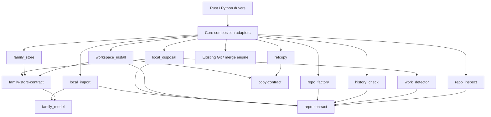

# GWZ local clone — implementation architecture

Status: **PROPOSED 2026-09-05 revision 3**. Follows the operator's
best-effort direction and independently testable library requirement;
product design revision 8, delivery plan revision 4. Incorporates the
second GPT-6/Sol review and independent F51 review at the planning level.
The new [library boundary adoption](GwzLocalCloneLibraryBoundaries.md)
is part of this architecture. No compiled interface, implementation,
performance target or independent acceptance of this revision is claimed.

## 1. Keep the implementation small

Use ordinary filesystem copying, native copy-on-write where available,
a small family index, ordinary Git refs, and the existing merge engine.
An interrupted operation may leave a partial directory or unused import
refs. Report that state and allow explicit inspection/retention. Manual
cleanup is an acceptable result.

No new persistent filesystem identity library, checked-artifact catalog,
durable transaction journal, deletion replay engine, merge-record version,
or global mutator-admission migration. Existing merge/catalog behavior
continues unchanged. A new native filesystem primitive is not required
merely to support the ordinary-copy path.

The concurrency assumption is explicit: involved workspaces and deletion
witnesses are quiescent during the local command, including unrelated
GWZ activity. One advisory family lock serializes family operations;
ordinary commands keep their existing locking. No atomic tree snapshot,
protection against arbitrary concurrent replacement, or new power-loss
recovery guarantee is claimed.

Best effort does not mean ignoring errors. Failed reads/writes/copies
are reported; unknown work/history refuses ordinary deletion; an invalid
family pointer does not authorize deleting a path.

## 2. Independently compiled libraries

Every functional library below is a private path crate under
`gwz-core/crates/`. The authoritative package names, roles, allowed edges,
file owners, public boundary operations and test commands are in
[Library boundaries and testing](GwzLocalCloneLibraryBoundaries.md).
That document explicitly adopts LBT-001–012 for these new libraries.
Modules within core are reserved for thin composition/translation adapters.
Neither Rust nor Python drivers reimplement policy.

| Library | Responsibility | Fast tests use | Complexity |
|---|---|---|---:|
| `refcopy` | Native selection, ordinary fallback, traversal/exclusions | Tiny trees, injected failures and shared copy conformance | 3/5 |
| `repo_inspect` | Read Git layout/work/ref/reflog/object observations | Small real repositories, read failures, shared read conformance | 3/5 |
| `work_detector` | Classify supplied unsaved-work observations | Plain values and known physical-byte observations | 3/5 |
| `history_check` | Bounded traversal establishing preserved history | In-memory object-reader fixtures, no actual Git dependency | 4/5 |
| `family_model` | Names, row decisions, shared remote-token resolution | Pure tables including all verb/state combinations | 2/5 |
| `family_store` | Sole index/pointer/marker writer and family lock | Tiny temporary metadata, injected errors, store conformance | 2/5 |
| `local_import` | Pair/capture/fetch/verify and push policy | Fake transport recording exact calls and partial effects | 3/5 |
| `workspace_install` | Copy/construction and fresh-metadata ordering | Copy/store contracts and fake configuration/construction ports | 3/5 |
| `repo_factory` | Independent bare/clean repository construction | Fake repository builder and captured vectors | 3/5 |
| `local_disposal` | Fresh checks, explicit keep and one-shot removal | Fake evidence/history/removal ports; no core dependency | 3/5 |

Three small contracts separate copy, repository reads and family storage
from their implementations. Pure family/work policy does not require an
artificial trait. Integration packages own their other consumed ports;
core connects them to real implementations. The following is a composition
view; the boundary document's dependency allowlist governs Cargo edges.



No library depends on core, a driver, the existing application test harness
or a concrete sibling through its dev dependencies. An unrelated unfinished
implementation cannot block another library's build merely because core
contains both. Contract changes test affected consumers; dependencies on
small pure/contract packages remain real dependencies.

Tier A runs each package's own `cargo test -p gwz-<name> --lib`: target
≤ 2 seconds test execution and ≤ 10 seconds warm incremental build plus
tests per package. These are unmeasured targets. Separate real-adapter
slices, native smoke tests and broad milestone acceptance from that loop;
record cold builds separately. The boundary document defines exact Cargo
names, tier commands, measurement context and the planned architecture gate.

After the skeleton is built and checks pass, an independent reviewer who
did not implement it reviews the exact commit, real adapters, contracts and
timing evidence. Resolve and verify blocking findings before opening
parallel feature lanes; plan LCM1.0d records this required review gate.

Use the existing Git backend through narrow core adapters. Anonymous local
fetch/push does not exist there yet; LCM1.0 adds and verifies that seam.
Do not extract the entire backend or checked-artifact subsystem. Core
interprets GWZ merge/stash metadata into plain boundary values. Public
messages remain taut-generated; library types are not a second protocol.

## 3. `refcopy`: fast when available, ordinary when necessary

```text
copy_tree(source, new_destination, exclusions, mode, cancellation)
    -> CopyReport | CopyError
mode = Auto | OrdinaryOnly
CopyReport = native_files + ordinary_files + logical_bytes + warnings
CopyError = failed_path + reason + partial_report
```

The caller has already rejected source/destination overlap, registered
paths and nonempty destinations. Traverse included entries and apply
exclusions before copying them. Do not copy identity files and remove
them afterward. Use ordinary canonical-path/no-follow checks to avoid
obvious mistakes; no new persistent-handle identity protocol is required.

Native candidates are Apple's clonefile family, Linux FICLONE, and a
Windows system-copy/block-clone path where supported. The operation's
result decides whether that source/destination pair supports it. A
capability probe is only a hint. Platform references:
[Apple clonefile](https://github.com/apple-oss-distributions/xnu/blob/main/bsd/man/man2/clonefile.2),
[Linux FICLONE](https://man7.org/linux/man-pages/man2/ioctl_ficlone.2.html),
[Microsoft block cloning](https://learn.microsoft.com/en-us/windows-server/storage/refs/block-cloning).

Fallback rules:

- Classified unsupported/cross-device native operations fall back to
  ordinary copying. Do not treat every EINVAL, invalid descriptor,
  permission error, ENOSPC or EIO as missing native capability.
- Reset only the newly created destination file before fallback from a
  partial native attempt. Never append to partial data or keep a stale tail.
- Preserve exact file contents, entry type, symlink target and normal
  permission/executable behavior. Use native metadata copying where
  available. Report unsupported ancillary metadata instead of building
  a cross-platform ACL/xattr/stream equivalence subsystem.
- Ordinary copying handles short writes, cancellation, empty/large files
  and logical bytes of sparse files. Do not follow user symlinks or block
  on FIFOs/sockets. Unsupported entry types refuse.
- Never create hardlinks to source files. Native copy-on-write may share
  physical blocks, but later writes must be independent.
- Use normal temporary-file/rename and available flush helpers; check
  their errors. A successful copy report does not establish crash durability
  or make the family row ready.

Do not shell out to an unexamined recursive-copy command whose exclusions
or symlink behavior differ by platform. Keep native wrappers small and
put fallback/exclusion policy in the common library. Ordinary system-copy
APIs may optimize internally; report physical cloning only when known.

**Tests:** native and forced ordinary copy produce equal included bytes;
mutating either side leaves the other unchanged; excluded paths never
appear; nested symlinks remain links; failures stop and report partial
results. Test short writes, failed native attempts and metadata errors.
Native-path smoke tests assert the native path actually ran. No exhaustive
power-loss, inode-reuse or mount-replacement matrix is part of this library.

## 4. `repo_inspect` and `work_detector`

```text
inspect_layout(path) -> RepositoryInfo | Unsupported
observe_work(repository) -> Known(WorkObservation) | Unknown(reasons)
inventory_history(repository) -> Known(ProtectedRoots) | Unknown(reasons)
classify_work(observations, gwz_evidence) -> WorkReport
```

Use typed OIDs including the repository's object format; do not assume
40-character SHA-1. Reuse Git reads rather than implementing another
object database. No implicit fetch, maintenance, index rewrite or flag
clearing during inspection.

Before create, scan **all included repositories**, including unmanaged
and ignored nested repositories. Apply design §4.0 identity/exclusion
checks to each or refuse before reservation. Gitfiles, external common
or object directories, alternates, escaping metadata/configuration and
unsupported partial/promisor layouts must not slip through a copy of
otherwise untracked data. Deletion also inventories all contained repos.
Do not follow user symlinks outside the tree during that inventory.
Resolve effective `core.hooksPath` for the destination before reservation,
including relative paths and Git's worktree/Git-directory hook working
directories. Refuse escapes; preserve valid internal relative paths. An
unresolvable effective configuration is unsupported, not an admission.

The detector's “unsaved chunks” are on-disk work: staged/unstaged changes,
untracked and ignored user files, conflict stages, mode/link changes,
binary files and unfinished native/GWZ operations. It cannot read unsaved
editor buffers. Textual diff hunks are optional presentation, not the
safety oracle. An ignore rule does not establish reproducibility.

For assume-unchanged, skip-worktree and other status-suppression flags,
observe present tracked paths physically or return unknown. Treat valid
sparse absence separately. Never clear live index flags to implement a
read-only check. Do not substitute “Git status is empty” for this contract.

Core supplies decoded GWZ merge/stash evidence. Unsupported/unreadable
formats are unknown. Diagnostic truncation does not remove a hazard.
LCM1 needs only create-layout/operation-state checks; the full work-loss
scan is required before LCM2 deletion.

**Tests:** staged and unstaged versions of the same file, binary edits,
renames/deletions/modes, ignored user data, ignored nested Git directories,
external gitfiles/alternates, unreadable entries, open operations, edited
assume-unchanged and present skip-worktree paths. Use known physical file
bytes as an oracle instead of asking status to validate itself.

## 5. `history_check`: read-only, in memory, bounded

```text
check_history(target_inventory, surviving_repositories, limits)
    -> Verified(coverage) | Unpreserved(items) | Unknown(reasons)
```

Protect every ref, HEAD (including detached), retained reflog root,
annotated object and native stash history. Also check the coordination
records and referenced objects of GWZ stash bundles via core adapters.
Cover root explicitly and report unsupported nested-repository evidence.

Witnesses are ready family repositories outside the entire deletion
subtree, paired by member/source identity. Check that each protected root's
complete object graph is reachable from surviving refs/HEAD with locally
available objects. Object presence without a retained root, cached origin
state in the target, a matching ref name or a squash patch does not suffice.
Different target repositories may have different witnesses. Exact protected
OIDs and available reachable graphs are the evidence.

Persistent `refs/gwz/local-imports/...` refs are eligible witness roots.
Existing temporary operation refs are excluded. Unknown or incomplete
object data cannot certify preservation. Network-only history must first
be fetched into a surviving family repository, or the lane stays.

Pass explicit resource limits. A simple initial cap is 100,000 protected
roots and 256 MiB of verifier bookkeeping; exceeding either returns
unknown before a disposing row is written. Memoize graph visits within
an invocation. The verifier must account for its own buffers/indices;
these are bounds on its work, not a promise about total process memory.
If an existing graph helper cannot be bounded, reject the affected scan
instead of adding a disk-backed proof system.

**Do not persist the coverage proof.** It is a current observation for
one explicit command with quiescent target/witnesses. No replay after
partial deletion is supported, so no historical graph, sidecar, durable
witness obligation or proof-size schema is needed. Family metadata remains
bounded separately. The numerical limits can be adjusted from measured
fixtures without changing the preservation rule.

**Tests:** clean unique commit; root-only history; secondary branch;
reflog-only commit; annotated tag; stash stack/coordination; exact-history
versus squash; missing objects; persistent imports versus temporary refs;
bare hub; unknown nested repository; limit exceeded. No deletion calls
exist in this library.

## 6. `family_model` and `family_store`

The model is a small pure crate: validate names/row states, project list
results, and decide whether a requested local operation may proceed.
States are creating, ready and disposing. Incomplete/missing/mismatched
observations are explicit. It does not replay transactions.
It also owns the single `resolve_remote_token` function used by all three
exchange verbs. Follow the boundary document's table: a non-ready merge
selector reports `UnknownLocal` with state detail; pull/push reports a
lifecycle refusal. Only an absent pull/push family row permits Git fallback.

The store owns `.gwz/local-family.yml`, clone pointers/allocation markers,
and the root advisory family lock. One locked reread/validate/write path
owns index updates. Limit the encoded index to 1 MiB. Use normal temporary
write/rename, check errors and leave malformed state for inspection; no
catalog enrollment or durable filesystem capability framework.
All installers/disposal/keep/disband callers use its live session port;
none writes these files independently. Its small OS try-lock wrapper and
ordinary publication code belong to this crate. Private checked-artifact
locks and the pinned single-caller verified writer are not reusable ports.
Do not turn lock-file existence into a stale-lock/recovery protocol.

Acquire the family lock for create/dispose/disband and family exchanges,
including a synchronous merge/pull engine call. Do not pre-acquire endpoint
workspace locks. The inner engine sees an ordinary local ref, not a family
lookup, and manages its existing locks itself. Existing shared mutation
entry points do not change. Ordinary endpoint/witness writers are excluded
by the documented operator quiescence requirement, not a new global guard.

List is observation-only, even for recoverable-looking states. A repeated
explicit pointer-only operation may finish its own matching removals;
no read or unrelated command promotes a clone or deletes files. Family
identity is derived by core from the index/pointer, never accepted as
public client authority.

**Tests:** name/path/id mismatch, collision, index-size refusal, partial
write, one competing family operation returning busy, list before/after
incomplete states with exact no-write assertions, repeatable keep/disband.
These test ordinary process behavior, not a universal crash-recovery model.

## 7. `local_import`: ordinary refs instead of a new lifetime protocol

Core first validates request shape and refuses unsupported family dry-run
before any write, including creation of a lock file. This applies to local
create and family exchange in v0; ordinary non-family dry-run behavior
remains as implemented. Reject malformed family start requests before
imports. Later engine-state failures may still leave retained imports.

Resolve names through `family_model` and pair all selected endpoints by
identity; preserve existing root selection and branch semantics. Capture
all source OIDs, then fetch through anonymous local transport using one fresh import name:

```text
refs/gwz/local-imports/<transfer-id>
```

Every paired receiver uses that same name for its captured source OID.
Refuse collisions and verify the full received vector before invoking an
engine. Partial/mismatched fetch leaves the refs it created and reports
failure; it never starts a partially sourced merge. Retry with a fresh id.

Pass the import ref to existing merge planning. Existing records still
contain normal participant source OIDs; no v1 field, source-owner handoff,
backup-ref grammar extension, or merge GC modification is introduced.
Intercept the family request before the normal merge mutation guard:
resolve/import, clear the family selector, and delegate once with the
local source ref. Do not recursively enter family resolution while
holding its lock.
The family wrapper holds only the family lock. Existing merge start can
release/reacquire its current workspace locks without self-conflict from
an extra outer receiver lock. This intentionally accepts the narrower
quiescence model instead of guaranteeing concurrent endpoint exclusion.

**Retain import refs indefinitely in this version.** Do not prune on
success, failure, cancellation, crash, detach or disband. Standard Git refs
retain objects through ordinary GC; a process crash does not require a
separate operation journal to discover why they exist. A half-finished
import can leave extra retained data. That disk cost is accepted. Manual
pruning must respect open merges; automatic pruning is a separate future
feature, not deferred required cleanup inside the MVP.

Use a namespace separate from `refs/gwz/merge/...`, whose current canonical
refs concern receiver preservation. No named family remotes or origin
tracking updates. Push keeps ordinary explicit refspec/partial-result and
checked-out-branch rules. Pull reuses the import mechanism while preserving
existing same-branch and sync policy.

**Tests:** dry-run/invalid-request refusal with zero write/transport calls;
complete pairing before fetch; exact OIDs; collision/mismatch;
partial imports retained; merge conflict/continue/abort; source detach or
advance after start; ordinary GC leaves imported objects; existing merge
behavior unchanged. No pause-at-every-internal-lease-handoff matrix needed.

## 8. Installation and one-shot disposal

`workspace_install` composes copy/construction ports, source recheck,
family-store calls for fresh pointer/allocation marker, and a core adapter
to existing configuration-integrity helpers. It never writes family files
directly. `repo_factory` and `local_disposal` are also independent crates;
core implements their narrow Git/history/removal ports.
Apply design §4.1 exclusions during copying, including the root family
lock and prior allocation marker. Publish manifest last and then ready.
An error between those steps leaves an incomplete row for inspection;
there is no automatic promotion or cleanup. Keep detaches metadata and
retains the directory. `repo_factory` later adds bare and clean construction
using the same installer and existing Git helpers.

`local_disposal` is the only local-clone service that removes directory
contents. Under the family lock, validate an intact ready target and run
fresh work/history checks. Refuse root/cwd, unexpected paths and ordinary
deletion with dirty/unpreserved/unknown evidence. Explicit named waivers
apply only to an intact ready tree and never excuse path mismatch.
Write disposing successfully before removal, then use ordinary recursive
removal without following symlink entries into external directories.

On error, stop and report what remains. Do not roll back or replay. An
interrupted disposing row can only be inspected, detached with keep, or
removed as a stale row after the target is gone. Manual cleanup is an
accepted exit. No proof reconstruction, persisted force replay, witness
locks held across invocations, or automatic incomplete-create deletion.

**Tests:** final manifest ordering; byte-copy/install failure; clean/bare
construction; default history refusal; explicit ready-tree waivers;
partial deletion stops; keep preserves the remainder; list stays read-only.
Use injected removal errors and real disposable directories. Existing
conf-integrity tests remain; new catalog/durable-identity tests do not.

## 9. Runtime cost and delivery

| Operation | Expected cost |
|---|---|
| Ordinary copy | O(entries + bytes), bounded copy buffer |
| Native copy | Entry traversal plus filesystem-dependent extent/metadata work; not constant-time workspace copying |
| Work scan | Entry traversal plus bytes needed to establish worktree differences |
| History check | Distinct roots/objects/edges and object bytes examined, with bounded bookkeeping and unknown on limits |
| Family metadata | Small bounded index read/write under one advisory lock |
| Deletion | Ordinary entry removal; no recovery replay |

Measure native versus ordinary copying with a representative target tree.
Do not add an unconditional full-byte second pass that defeats the native
optimization without a demonstrated need. Git connectivity and work/history
inspection have separate costs and should be measured separately.

The revised plan estimates LCM1 at **9–16**, LCM2 at **7–12**, and LCM3 at
**4–7** focused engineer-days: **20–35 total**. This adds 1–2 days to the
previous total for explicit contract/package ownership, skeleton and the
local architecture gate; it is not measured productivity or elapsed time
with multiple agents. Re-estimate after LCM1.0. Its exit measures copy
performance and each library's fast loop, alongside the import adapter.
Tests travel with each stage; no filesystem research program is added.

| New-library performance evidence | Status |
|---|---|
| Tier A execution / warm edit-build-test / cold build, each package | Not measured; record host/toolchain/SHA at LCM1.0 |
| Native and forced ordinary representative-tree copy | Not measured for this implementation; LCM1.0a output |
| Real-adapter and full acceptance tiers | Commands/budgets to verify at LCM1.0; actual results at milestone exits |

F51 measured existing core tests, not these proposed packages: 12 filtered
conf-integrity tests took 0.20 seconds execution and 1.2 seconds wall on
its host; a separate mtime-triggered core rebuild took 5.4 seconds. Sol
observed 22.65 seconds wall after recompilation for another single-test
command. Those different workloads are not a benchmark comparison and do
not prove new targets. They support separating execution, warm rebuild and
cold compilation in the measurements. No implementation or native-platform
acceptance tests were run while writing this revision.
